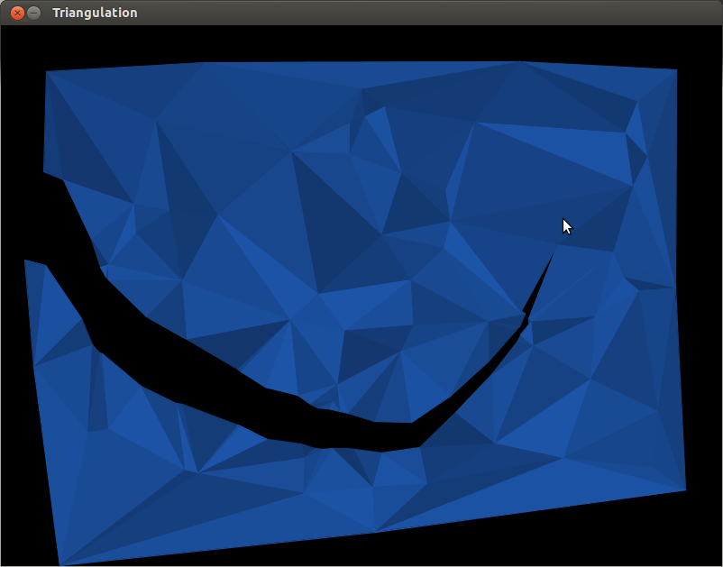
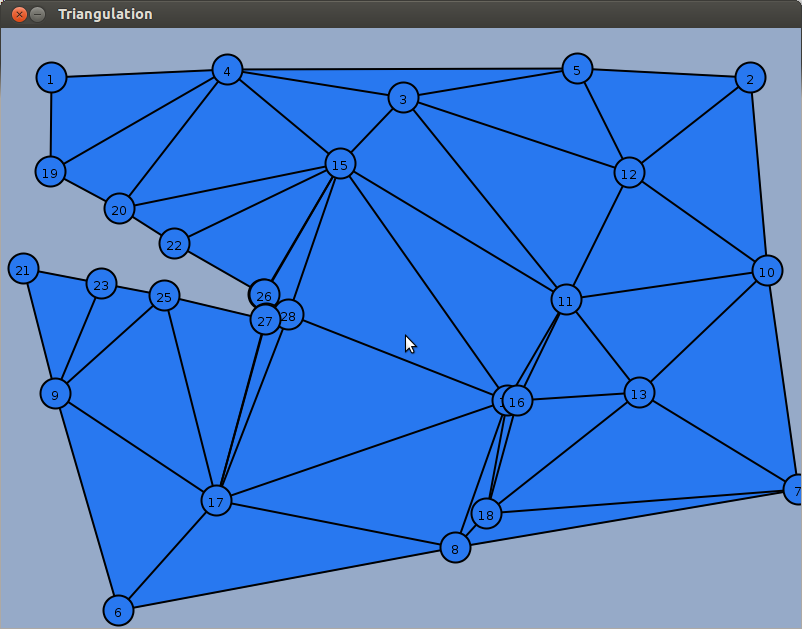

# Delaunay triangulation

**CS 6491, Computer graphics, Fall 2012**

This project builds a Delaunay triangulation on a set of randomly-generated vertices. The resulting
triangle mesh is used as the basis of a simple physics simulation in which the mass at each vertex is
accelerated by gravity and a springlike force exerted by each triangle edge. A click-and drag interface
allows a user to break apart triangles in a manner that somewhat resembles slicing through a sheet of
material.

[Paper](http://chris-martin.github.io/delaunay/delaunay.pdf)

